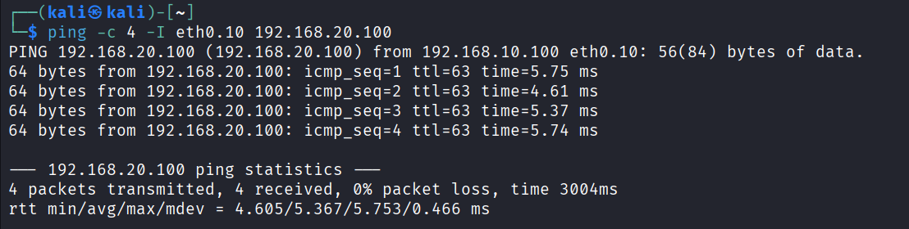
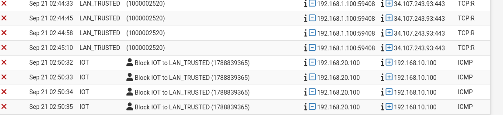

# Testing — VLAN Isolation

## Setup
Two test VMs, manually VLAN-tagged (VirtualBox does not support 802.1Q tagging at the virtual switch level, so tagging was done inside each guest OS):

- Kali Linux — tagged into VLAN 10 (LAN_TRUSTED), IP 192.168.10.100
ip link add link eth0 name eth0.10 type vlan id 10
ip link set eth0.10 up
dhclient eth0.10

- Debian — tagged into VLAN 20 (IOT), IP 192.168.20.100
ip link add link enp0s3 name enp0s3.20 type vlan id 20
ip link set enp0s3.20 up
dhcpcd enp0s3.20

Each VM's original untagged default route was removed to avoid routing conflicts between the native LAN interface and the new VLAN sub-interface:
ip route del default via 192.168.1.1 dev <interface>

## Test 1 — LAN_TRUSTED to IOT (expected: allowed)
LAN_TRUSTED has a permissive "allow to anywhere" rule, so trusted devices can reach other VLANs.

ping -c 4 -I eth0.10 192.168.20.100

Result: 0% packet loss — traffic passed as expected.

## Test 2 — IOT to LAN_TRUSTED (expected: blocked)
IOT is explicitly blocked from reaching LAN_TRUSTED, to prevent a compromised IoT device from accessing trusted devices.

ping -c 4 -I enp0s3.20 192.168.10.100

Result: 100% packet loss — traffic blocked as expected.

The firewall log confirms the block was enforced by the intended rule (Block IOT to LAN_TRUSTED), not a generic default-deny:

## Troubleshooting note
An early test run showed both directions blocked, and the firewall log listed the traffic under interface LAN instead of IOT. Root cause: both test VMs still had their original untagged default route active (via the LAN interface), which raced with the new VLAN route and caused traffic to take the wrong path. Removing the stale default route on each VM resolved this.

## Conclusion
VLAN segmentation and firewall rules behave as designed: LAN_TRUSTED has open access, IOT and GUEST are isolated from LAN_TRUSTED and from each other, while all VLANs retain internet access.